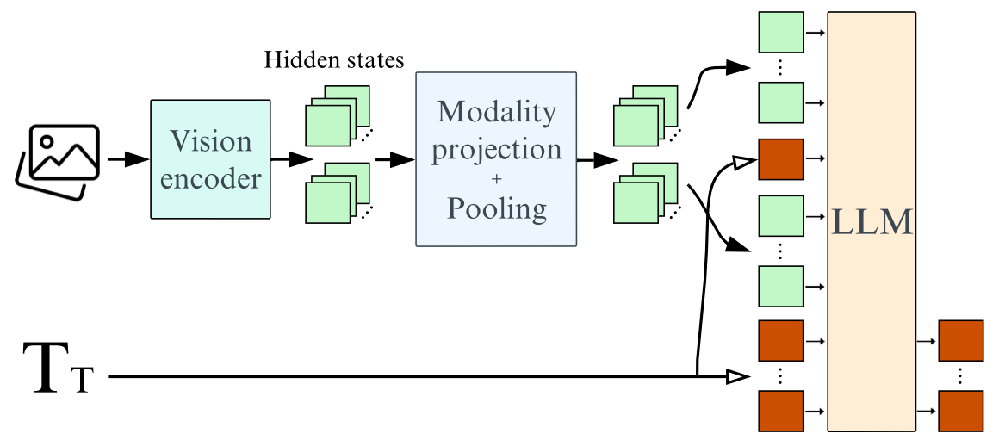
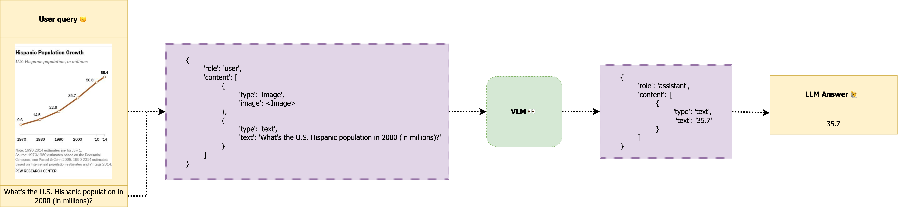

# Visual Language Models

Visual Language Models (VLMs) bridge the gap between images and text, enabling advanced tasks like generating image captions, answering questions based on visuals, or understanding the relationship between textual and visual data. Their architecture is designed to process both modalities seamlessly.

### Architecture

VLMs combine image-processing components with text-generation models to achieve a unified understanding. The primary elements of their architecture are:



- **Image Encoder**: Transforms raw images into compact numerical representations. Pretrained encoders such as CLIP or vision transformers (ViT) are commonly used.
- **Embedding Projector**: Maps image features into a space compatible with textual embeddings, often using dense layers or linear transformations.
- **Text Decoder**: Acts as the language-generation component, translating fused multimodal information into coherent text. Examples include generative models like Llama or Vicuna.
- **Multimodal Projector**: Provides an additional layer to blend image and text representations. It is critical for models like LLaVA to establish stronger connections between the two modalities.

Most VLMs leverage pretrained image encoders and text decoders and align them through additional fine-tuning on paired image-text datasets. This approach makes training efficient while allowing the models to generalize effectively.

### Usage



VLMs are applied to a range of multimodal tasks. Their adaptability allows them to perform in diverse domains with varying levels of fine-tuning:

- **Image Captioning**: Generating descriptions for images.
- **Visual Question Answering (VQA)**: Answering questions about the content of an image.
- **Cross-Modal Retrieval**: Finding corresponding text for a given image or vice versa.
- **Creative Applications**: Assisting in design, art generation, or creating engaging multimedia content.


Training and fine-tuning VLMs depend on high-quality datasets that pair images with text annotations. Tools like Hugging Face's `transformers` library provide convenient access to pretrained VLMs and streamlined workflows for custom fine-tuning.

### Chat Format

Many VLMs are structured to interact in a chatbot-like manner, enhancing usability. This format includes:

- A **system message** that sets the role or context for the model, such as "You are an assistant analyzing visual data."
- **User queries** that combine text inputs and associated images.
- **Assistant responses** that provide text outputs derived from the multimodal analysis.

This conversational structure is intuitive and aligns with user expectations, especially for interactive applications like customer service or educational tools.

Here’s an example of how a formatted input might look:

```json
[
    {
        "role": "system",
        "content": [{"type": "text", "text": "You are a Vision Language Model specialized in interpreting visual data from chart images..."}]
    },
    {
        "role": "user",
        "content": [
            {"type": "image", "image": "<image_data>"},
            {"type": "text", "text": "What is the highest value in the bar chart?"}
        ]
    },
    {
        "role": "assistant",
        "content": [{"type": "text", "text": "42"}]
    }
]
```

**Working with Multiple Images and Videos**

VLMs can also process multiple images or even videos by adapting the input structure to accommodate sequential or parallel visual inputs. For videos, frames can be extracted and processed as individual images, while maintaining temporal order.

## Resources

- [Hugging Face Blog: Vision Language Models](https://huggingface.co/blog/vlms)
- [Hugging Face Blog: SmolVLM](https://huggingface.co/blog/smolvlm) 

## Next Steps

⏩ Try the [vlm_usage_sample.ipynb](./notebooks/vlm_usage_sample.ipynb) to try different usages of SMOLVLM.