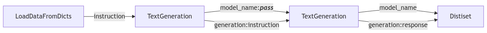

# Generating Instruction Datasets

Within [the chapter on instruction tuning](../1_instruction_tuning/README.md), we learned about fine-tuning models with Supervised Fine-tuning. In this section, we will explore how to generate instruction datasets for SFT. We will explore creating instruction tuning datasets through basic prompting and using more refined techniques from papers. Instruction tuning datasets with seed data for in-context learning can be created through methods like SelfInstruct and Magpie. Additionally, we will explore instruction evolution through EvolInstruct. Lastly, we will explore how to generate a dataset for instruction tuning using a distilabel pipeline.

## From Prompt to Data

Synthetic data sounds fancy, but it can be simplified as creating data through effective prompting to extract knowledge from a model. In turn, you can think of this as a way to generate data for a specific task. The challenge is prompting effectively while ensuring the data is diverse and representative. Fortunately, many papers have explored this problem, and we will explore some of the useful ones during this course. First things first, we will explore how to generate synthetic data through manual prompting.

### Basic Prompting

Let's start with a basic example and load the [HuggingFaceTB/SmolLM2-1.7B-Instruct](https://huggingface.co/HuggingFaceTB/SmolLM2-1.7B-Instruct) model using the `transformers` integration of the `distilabel` library. We will use the `TextGeneration` class to generate a synthetic `prompt` and use that to generate a `completion`.

Next, we will load the model using the `distilabel` library.

```python
from distilabel.llms import TransformersLLM
from distilabel.steps.tasks import TextGeneration

llm = TransformersLLM(model="HuggingFaceTB/SmolLM2-1.7B-Instruct")
gen = TextGeneration(llm=llm)
gen.load()
```

!!! note
    Distilabel loads the `llm` into memory, so, when working in a notebook, we need to `gen.unload()` after we are done with it to avoid memory issues.

We will now use the `llm` to generate a `prompt` for instruction tuning.

```python
next(gen.process([{"instruction": "Generate a questions about the Hugging Face Smol-Course on small AI models."}]))
# What is the purpose of Smol-Course?
```

Lastly, we can use that same `prompt` as input to generate a `completion`.

```python
next(gen.process([{"instruction": "What is the purpose of Smol-Course?"}]))
# The Smol-Course is a platform designed to learning computer science concepts.
```

Cool! We can generated a synthetic `prompt` and a corresponding `completion`. Re-using this simple approach at scale will allow us to generate a lot more data however, the quality of the data is not that great and does not take into account the nuances of our course or domain. Additionally, re-running the current code shows us the data is not that diverse. Luckily, there are ways to solve this problem.

### SelfInstruct

SelfInstruct is a prompt that generates new instructions based on a seed dataset. This seed data can be a single instruction or a piece of context. The process begins with a pool of initial seed data. The language model is then prompted to generate new instructions based on this seed data using in-context learning. The prompt is [implemented in distilabel](https://github.com/argilla-io/distilabel/blob/main/src/distilabel/steps/tasks/templates/self-instruct.jinja2) and a simplified version is shown below:

```
# Task Description
Develop {{ num_instructions }} user queries that can be received by the given AI application and applicable to the provided context. Emphasize diversity in verbs and linguistic structures within the model's textual capabilities.

# Context
{{ input }}

# Output
```

To use it, we need to pass the `llm` to the [SelfInstruct class](https://distilabel.argilla.io/dev/components-gallery/tasks/selfinstruct/). Let's use the text from the [Prompt to Data section](#prompt-to-data) as context and generate a new instruction.

```python
from distilabel.steps.tasks import SelfInstruct

self_instruct = SelfInstruct(llm=llm)
self_instruct.load()

context = "<prompt_to_data_section>"

next(self_instruct.process([{"input": text}]))["instructions"][0]
# What is the process of generating synthetic data through manual prompting?
```

The generated instruction is a lot better already and it fits our actual content and domain. However, we can do even better by improving the prompt through evolution.

### EvolInstruct

EvolInstruct is a prompting technique that takes an input instruction and evolves it into a better version of the same instruction. This better version is defined according to a set of criteria and adds constraints, deepening, concretizing, reasoning or complications to the original instruction. The process can be repeated multiple times to create various evolutions of the same instruction, ideally leading to a better version of the original instruction. The prompt is [implemented in distilabel](https://github.com/argilla-io/distilabel/tree/main/src/distilabel/steps/tasks/evol_instruct) and a simplified version is shown below:

```
I want you act as a Prompt Rewriter.
Given prompt a prompt, rewrite it into a more complex version.
Complicate the prompt based on the following criteria:
{{ criteria }}

# Prompt
{{ input }}

# Output
```

To use it, we need to pass the `llm` to the [EvolInstruct class](https://distilabel.argilla.io/dev/components-gallery/tasks/evolinstruct/). Let's use the synthetic prompt from [the SelfInstruct section](#selfinstruct) as input and evolve it into a better version. For this example, we will only evolve for one generation.

```python
from distilabel.steps.tasks import EvolInstruct

evol_instruct = EvolInstruct(llm=llm, num_evolutions=1)
evol_instruct.load()

text = "What is the process of generating synthetic data through manual prompting"

next(evol_instruct.process([{"instruction": text}]))
# What is the process of generating synthetic data through manual prompting?
# And, how does the artificial intelligence system, GPT4, use machine learning algorithms to manipulate the input data into synthetic data?
```

The instruction is now more complex but has lost some of the original meaning. So, take into account that evolving can be a double-edged sword and we need to be careful with the quality of the data we generate.

### Magpie

Magpie is a technique that relies on the auto-regressive factors of language model and the [chat-template](../1_instruction_tuning/chat_templates.md) that has been using during the instruction tuning process. As you might remember, the chat-template is a format that structures conversations with clear role indicators (system, user, assistant). During the instruction tuning phase, the language model has been optimized to reproduce this format and that is exactly what magpie takes advantage of. It starts with a pre-query-prompt based on the chat-template but it stops before the user message indicator, e.g. `<|im_start|>user\n`, and then it uses the language model to generate the user prompt until the end of the assistant indicator, e.g. `<|im_end|>`. This approach allows us to generate a lot of data in a very efficient way and it can even be scaled up to multi-turn conversations. It is hypothesized this generated data reproduces training data from the instruction tuning phase of the model used.

In this scenario, prompt templates differ per model because they are based on the chat-template format. But we can walk through a simplified version of the process step-by-step.

```bash
# Step 1: provide the pre-query-prompt
<|im_start|>user\n

# Step 2: the language model generates the user prompt
<|im_start|>user\n
What is the purpose of Smol-Course?

# Step 3: stop the generation
<|im_end|>
```

To use it in distilabel, we need to pass the `llm` to the [Magpie class](https://distilabel.argilla.io/dev/components-gallery/tasks/magpie/).

```python
from distilabel.steps.tasks import Magpie

magpie = Magpie(llm=llm)
magpie.load()

next(magpie.process([{"system_prompt": "You are a helpful assistant."}]))
# [{
#   "role": "user",
#   "content": "Can you provide me with a list of the top 3 universities?"
# },
# {
#   "role": "assistant",
#   "content": "The top 3 universities are: MIT, Yale, Stanford."
# }]
```


We immediately get a dataset with a `prompt` and `completion` . To improve the performance on our own domain, we can inject additional context into the `system_prompt`. For the LLM to generate specific domain data in combination with Magpie, it helps describing in the system prompt what the users queries will be. This is then used in the  pre-query-prompt before we start generating the user prompt and bias the LLM to generate user queries of that domain.

```
You're an AI assistant that will help users solving math problems.
```

It's important to write the system prompt as shown above instead of something like:

```
You're an AI assistant that generates math problems
```

Generally, language models are less optimized for passing additional context to the `system_prompt` so this does not always work as well for customisation as other techniques.

### From Prompts to Pipelines

The classes we've seen so far are all standalone classes that can be used in a pipeline. This is a good start, but we can do even better by using the `Pipeline` class to generate a dataset. We will use the `TextGeneration` step to generate a synthetic dataset for instruction tuning. The pipeline will consist of a `LoadDataFromDicts` step to load the data, a `TextGeneration` step to generate the `prompt` and a `completion` for that prompt. We will connect the steps and flow the data through the pipeline using the `>>` operator. Within the [documentation of distilabel](https://distilabel.argilla.io/dev/components-gallery/tasks/textgeneration/#input-output-columns) we can see input and output columns of the step. We to ensure that the data flow correctly through the pipeline, we will use the `output_mappings` parameter to map the output columns to the input columns of the next step.

```python
from distilabel.llms import TransformersLLM
from distilabel.pipeline import Pipeline
from distilabel.steps import LoadDataFromDicts
from distilabel.steps.tasks import TextGeneration

with Pipeline() as pipeline:
    data = LoadDataFromDicts(data=[{"instruction": "Generate a short question about the Hugging Face Smol-Course."}])
    llm = TransformersLLM(model="HuggingFaceTB/SmolLM2-1.7B-Instruct")
    gen_a = TextGeneration(llm=llm, output_mappings={"generation": "instruction"})
    gen_b = TextGeneration(llm=llm, output_mappings={"generation": "response"})
    data >> gen_a >> gen_b

if __name__ == "__main__":
    distiset = pipeline.run(use_cache=False)
    print(distiset["default"]["train"][0])
# [{
#   "instruction": "What is the purpose of Smol-Course?",
#   "response": "The Smol-Course is a platform designed to learning computer science concepts."
# }]
```

Under the hood, this pipeline has a lot of cool features. It automatically caches generation results, so we can don't have to re-run the generation steps. There is included fault-tolerance, so if the generation steps fail, the pipeline will continue to run. And the pipeline exexutes all generation steps in parallel, so the generation is faster. We can even visualise the pipeline using the `draw` method. Here you can see how the data flows through the pipeline and how the `output_mappings` are used to map the output columns to the input columns of the next step.



## Best Practices

- Ensure you have a diverse seed data to cover a wide range of scenarios
- Regularly evaluate the dataset to ensure generated data is diverse and of high quality
- Iterate on the (system)prompt to improve the quality of the data

## Next Steps

👨🏽‍💻 Code -[Exercise Notebook](./notebooks/instruction_sft_dataset.ipynb) to generate a dataset for instruction tuning
🧑‍🏫 Learn - About [generating preference datasets](./preference_datasets.md)

## References

- [Distilabel Documentation](https://distilabel.argilla.io/latest/)
- [Self-instruct](https://arxiv.org/abs/2212.10560)
- [Evol-Instruct](https://arxiv.org/abs/2304.12244)
- [Magpie](https://arxiv.org/abs/2406.08464)