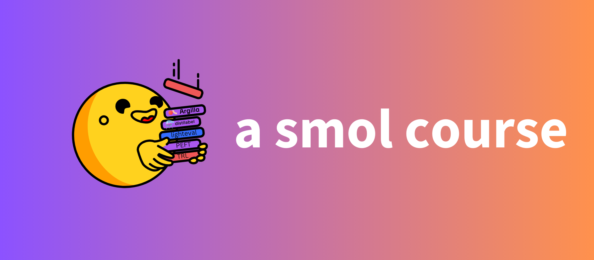

# Un Pequeño (Smol) Curso

Este curso práctico está enfocado en alinear modelos de lenguaje para casos de uso específicos. Es una forma accesible de empezar a trabajar con modelos de lenguaje, ya que puede ejecutarse en la mayoría de las máquinas locales con requisitos mínimos de GPU y sin necesidad de servicios pagos. El curso se basa en la serie de modelos [SmolLM2](https://github.com/huggingface/smollm/tree/main), pero las habilidades que adquieras aquí son transferibles a modelos más grandes o otros modelos pequeños de lenguaje.

<a href="http://hf.co/join/discord">

</a>

<div style="background: linear-gradient(to right, #e0f7fa, #e1bee7, orange); padding: 20px; border-radius: 5px; margin-bottom: 20px; color: purple;">
    <h2>¡La participación es abierta, gratuita y ahora!</h2>
    <p>Este curso es abierto y revisado por la comunidad. Para participar, simplemente <strong>abre un pull request</strong> y envía tu trabajo para su revisión. Sigue estos pasos:</p>
    <ol>
        <li>Haz un fork del repositorio <a href="https://github.com/huggingface/smol-course/fork">aquí</a></li>
        <li>Lee el material, haz cambios, completa los ejercicios y agrega tus ejemplos.</li>
        <li>Abre un PR en la rama december_2024</li>
        <li>Haz que se revise y se fusione</li>
    </ol>
    <p>Este proceso te ayudará a aprender y a construir un curso dirigido por la comunidad que mejora constantemente.</p>
</div>

Podemos discutir el proceso en este [hilo de discusión](https://github.com/huggingface/smol-course/discussions/2#discussion-7602932).

## Estructura del Curso

Este curso ofrece un enfoque práctico para trabajar con modelos pequeños de lenguaje, desde el entrenamiento inicial hasta el despliegue en producción.

| Módulo | Descripción | Estado | Fecha de lanzamiento |
|--------|-------------|--------|----------------------|
| [Ajuste de Instrucciones](./1_instruction_tuning) | Aprende ajuste fino (fine-tuning) supervisado, plantillas de chat y seguimiento básico de instrucciones | ✅ Completo | 3 de diciembre de 2024 |
| [Alineación de Preferencias](./2_preference_alignment) | Explora las técnicas DPO y ORPO para alinear modelos con las preferencias humanas | ✅ Completo | 6 de diciembre de 2024 |
| [Ajuste Fino (Fine-tuning) Eficiente en Parámetros](./3_parameter_efficient_finetuning) | Aprende LoRA, ajuste de prompt y métodos de adaptación eficientes | [🚧 En Progreso](https://github.com/huggingface/smol-course/pull/41) | 9 de diciembre de 2024 |
| [Evaluación](./4_evaluation) | Usa benchmarks automáticos y crea evaluaciones personalizadas para dominios | [🚧 En Progreso](https://github.com/huggingface/smol-course/issues/42) | 13 de diciembre de 2024 |
| [Modelos Visión-Lenguaje](./5_vision_language_models) | Adapta modelos multimodales para tareas visión-lenguaje | [🚧 En Progreso](https://github.com/huggingface/smol-course/issues/49) | 16 de diciembre de 2024 |
| [Conjuntos de Datos Sintéticos](./6_synthetic_datasets) | Crea y valida conjuntos de datos sintéticos para el entrenamiento | 📝 Planificado | 20 de diciembre de 2024 |
| [Inferencia](./7_inference) | Inferencia eficiente con modelos | 📝 Planificado | 23 de diciembre de 2024 |

## ¿Por qué Modelos Pequeños de Lenguaje?

Si bien los modelos grandes de lenguaje han mostrado capacidades impresionantes, requieren recursos computacionales significativos y pueden ser excesivos para aplicaciones específicas. Los modelos pequeños de lenguaje ofrecen varias ventajas para aplicaciones de dominio:

- **Eficiencia**: Requieren menos recursos computacionales para entrenar y desplegar
- **Personalización**: Más fáciles de ajustar para dominios específicos
- **Control**: Mayor control sobre el comportamiento del modelo
- **Costo**: Menores costos operativos para el entrenamiento y la inferencia
- **Privacidad**: Pueden ejecutarse localmente, manteniendo la privacidad de los datos
- **Sostenibilidad**: Uso eficiente de recursos con una huella de carbono más pequeña
- **Investigación Académica**: Facilita la investigación académica con menos restricciones logísticas

## Requisitos Previos

Antes de comenzar, asegúrate de tener:

- Conocimientos básicos en aprendizaje automático y procesamiento de lenguaje natural
- Familiaridad con Python, PyTorch y la librería `transformers`
- Acceso a un modelo de lenguaje preentrenado y un conjunto de datos etiquetado

## Instalación

Mantenemos el curso como un paquete para facilitar la instalación de dependencias. Recomendamos usar [uv](https://github.com/astral-sh/uv), pero también puedes utilizar alternativas como `pip` o `pdm`.

### Usando `uv`

Con `uv` instalado, puedes configurar el entorno del curso de esta manera:

```bash
uv venv --python 3.11.0
uv sync
```

### Usando `pip`

Para un entorno **python 3.11**, utiliza los siguientes comandos para instalar las dependencias:

```bash
# python -m venv .venv
# source .venv/bin/activate
pip install -r requirements.txt
```

### Google Colab

Para **Google Colab**, instala las dependencias de la siguiente manera:

```bash
pip install -r transformers trl datasets huggingface_hub
```

## Participación

Compartamos este curso para que muchas personas puedan aprender a ajustar LLMs sin necesidad de hardware costoso.

[](https://star-history.com/#huggingface/smol-course&Date)