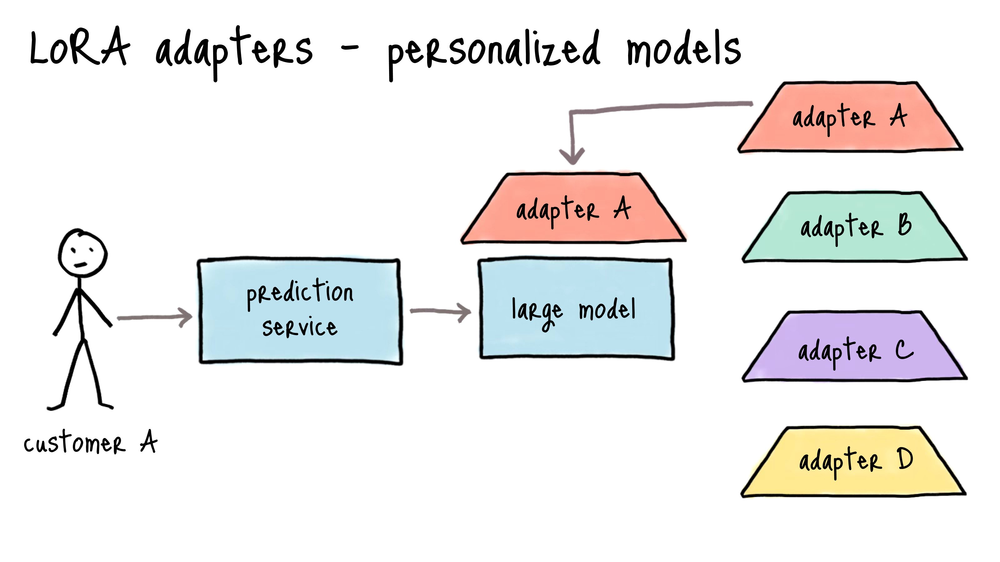

# LoRA (低ランク適応)

LoRAは最も広く採用されているPEFTメソッドとなっています。これは、注意重み行列に小さなランク分解行列を追加することで機能し、通常、学習可能なパラメータを約90％削減します。

## LoRAの理解

LoRA（低ランク適応）は、事前学習されたモデルの重みを固定し、学習可能なランク分解行列をモデルの層に注入するパラメータ効率の良い微調整技術です。微調整中にすべてのモデルパラメータを学習する代わりに、LoRAは低ランク分解を通じて重みの更新を小さな行列に分解し、学習可能なパラメータの数を大幅に削減しながらモデルの性能を維持します。例えば、GPT-3 175Bに適用した場合、LoRAは学習可能なパラメータを10,000倍、GPUメモリ要件を3倍削減しました。LoRAについての詳細は[LoRA論文](https://arxiv.org/pdf/2106.09685)を参照してください。

LoRAは、通常、注意重みに焦点を当てて、トランスフォーマーレイヤーにランク分解行列のペアを追加することで機能します。推論中に、これらのアダプタ重みはベースモデルと統合され、追加の遅延オーバーヘッドが発生しません。LoRAは、大規模な言語モデルを特定のタスクやドメインに適応させるのに特に役立ち、リソース要件を管理可能に保ちます。

## LoRAアダプタの読み込み

アダプタは、load_adapter()を使用して事前学習されたモデルに読み込むことができ、これは重みが統合されていない異なるアダプタを試すのに便利です。set_adapter()関数を使用してアクティブなアダプタ重みを設定します。ベースモデルに戻るには、unload()を使用してすべてのLoRAモジュールをアンロードできます。これにより、異なるタスク固有の重み間の切り替えが容易になります。

```python
from transformers import AutoModelForCausalLM
from peft import PeftModel

base_model = AutoModelForCausalLM.from_pretrained("<base_model_name>")
peft_model_id = "<peft_adapter_id>"
model = PeftModel.from_pretrained(base_model, peft_model_id)
```



## LoRAアダプタの統合

LoRAでトレーニングした後、アダプタ重みをベースモデルに統合して、デプロイを容易にすることができます。これにより、統合された重みを持つ単一のモデルが作成され、推論中にアダプタを別々に読み込む必要がなくなります。

統合プロセスには、メモリ管理と精度に注意が必要です。ベースモデルとアダプタ重みの両方を同時に読み込む必要があるため、十分なGPU/CPUメモリが利用可能であることを確認してください。`transformers`の`device_map="auto"`を使用すると、自動メモリ管理が容易になります。トレーニング中に使用した精度（例：float16）を一貫して維持し、統合されたモデルを同じ形式で保存してデプロイします。デプロイ前に、アダプタベースのバージョンと出力および性能メトリックを比較して、統合されたモデルを検証してください。

アダプタは、異なるタスクやドメイン間の切り替えにも便利です。ベースモデルとアダプタ重みを別々に読み込むことができます。これにより、異なるタスク固有の重み間の迅速な切り替えが可能になります。

## 実装ガイド

`notebooks/`ディレクトリには、さまざまなPEFTメソッドを実装するための実践的なチュートリアルと演習が含まれています。基本的な紹介には`load_lora_adapter_example.ipynb`を、LoRAとSFTを使用したモデルの微調整について詳しく知りたい場合は`lora_finetuning.ipynb`を参照してください。

PEFTメソッドを実装する際は、LoRAのランク値（4-8）を小さく設定し、トレーニング損失を監視します。検証セットを使用して過学習を防ぎ、可能であればフルファインチューニングのベースラインと結果を比較します。異なるメソッドの有効性はタスクによって異なるため、実験が重要です。

## OLoRA

[OLoRA](https://arxiv.org/abs/2406.01775)は、QR分解を使用してLoRAアダプタを初期化します。OLoRAは、QR分解の係数によってモデルのベース重みを変換します。つまり、トレーニングを行う前に重みを変換します。このアプローチは、安定性を大幅に向上させ、収束速度を加速し、最終的に優れた性能を達成します。

## TRLとPEFTの使用

PEFTメソッドは、TRL（Transformers Reinforcement Learning）と組み合わせて効率的な微調整を行うことができます。この統合は、RLHF（Reinforcement Learning from Human Feedback）に特に有用であり、メモリ要件を削減します。

```python
from peft import LoraConfig
from transformers import AutoModelForCausalLM

# PEFT設定でモデルを読み込む
lora_config = LoraConfig(
    r=16,
    lora_alpha=32,
    lora_dropout=0.05,
    bias="none",
    task_type="CAUSAL_LM"
)

# 特定のデバイスにモデルを読み込む
model = AutoModelForCausalLM.from_pretrained(
    "your-model-name",
    load_in_8bit=True,  # オプション: 8ビット精度を使用
    device_map="auto",
    peft_config=lora_config
)
```

上記では、`device_map="auto"`を使用してモデルを自動的に適切なデバイスに割り当てました。また、`device_map={"": device_index}`を使用してモデルを特定のデバイスに手動で割り当てることもできます。メモリ使用量を効率的に保ちながら、複数のGPUにトレーニングをスケールすることもできます。

## 基本的な統合実装

LoRAアダプタをトレーニングした後、アダプタ重みをベースモデルに統合することができます。以下はその方法です：

```python
import torch
from transformers import AutoModelForCausalLM
from peft import PeftModel

# 1. ベースモデルを読み込む
base_model = AutoModelForCausalLM.from_pretrained(
    "base_model_name",
    torch_dtype=torch.float16,
    device_map="auto"
)

# 2. アダプタを持つPEFTモデルを読み込む
peft_model = PeftModel.from_pretrained(
    base_model,
    "path/to/adapter",
    torch_dtype=torch.float16
)

# 3. アダプタ重みをベースモデルと統合
try:
    merged_model = peft_model.merge_and_unload()
except RuntimeError as e:
    print(f"統合に失敗しました: {e}")
    # フォールバック戦略またはメモリ最適化を実装

# 4. 統合されたモデルを保存
merged_model.save_pretrained("path/to/save/merged_model")
```

保存されたモデルのサイズに不一致がある場合は、トークナイザーも保存していることを確認してください：

```python
# モデルとトークナイザーの両方を保存
tokenizer = AutoTokenizer.from_pretrained("base_model_name")
merged_model.save_pretrained("path/to/save/merged_model")
tokenizer.save_pretrained("path/to/save/merged_model")
```

## 次のステップ

⏩ [プロンプトチューニング](prompt_tuning.md)ガイドに進み、プロンプトチューニングでモデルを微調整する方法を学びましょう。
⏩ [LoRAアダプタの読み込みチュートリアル](./notebooks/load_lora_adapter.ipynb)に進み、LoRAアダプタを読み込む方法を学びましょう。

# リソース

- [LORA: LOW-RANK ADAPTATION OF LARGE LANGUAGE MODELS](https://arxiv.org/pdf/2106.09685)
- [PEFTドキュメント](https://huggingface.co/docs/peft)
- [Hugging FaceのPEFTに関するブログ記事](https://huggingface.co/blog/peft)
