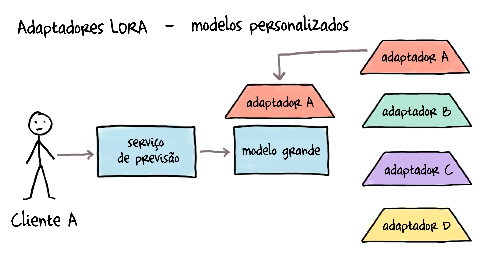

# LoRA (Low-Rank Adaptation - Adaptação de Baixa Classificação)

LoRA tornou-se o método PEFT mais amplamente adotado. Ele funciona adicionando pequenas matrizes de decomposição de classificação aos pesos de atenção, reduzindo tipicamente os parâmetros treináveis em cerca de 90%.

## Entendendo o LoRA

LoRA (Adaptação de Baixa Classificação) é uma técnica de ajuste fino eficiente em termos de parâmetros que congela os pesos do modelo pré-treinado e injeta matrizes treináveis de decomposição de classificação nas camadas do modelo. Em vez de treinar todos os parâmetros do modelo durante o ajuste fino, o LoRA decompõe as atualizações de peso em matrizes menores por meio da decomposição de baixa classificação, reduzindo significativamente o número de parâmetros treináveis enquanto mantém o desempenho do modelo. Por exemplo, quando aplicado ao GPT-3 175B, o LoRA reduziu os parâmetros treináveis em 10.000x e os requisitos de memória GPU em 3x em comparação ao ajuste fino completo. Você pode saber mais sobre o LoRA no [Artigo sobre LoRA](https://arxiv.org/pdf/2106.09685).

O LoRA funciona adicionando pares de matrizes de decomposição de classificação às camadas do transformer, geralmente focando nos pesos de atenção. Durante a inferência, esses pesos adaptadores podem ser mesclados com o modelo base, resultando em nenhuma sobrecarga adicional de latência. LoRA é particularmente útil para adaptar modelos de linguagem de grande porte a tarefas ou domínios específicos, mantendo os requisitos de recursos gerenciáveis.

## Carregando Adaptadores LoRA

Os adaptadores podem ser carregados em um modelo pré-treinado com load_adapter(), o que é útil para experimentar diferentes adaptadores cujos pesos não estão mesclados. Defina os pesos do adaptador ativo com a função set_adapter(). Para retornar ao modelo base, você pode usar unload() para descarregar todos os módulos LoRA. Isso facilita a alternância entre pesos específicos de tarefas.

```python
from transformers import AutoModelForCausalLM
from peft import PeftModel

base_model = AutoModelForCausalLM.from_pretrained("<base_model_name>")
peft_model_id = "<peft_adapter_id>"
model = PeftModel.from_pretrained(base_model, peft_model_id)
```



## Mesclando Adaptadores LoRA

Após o treinamento com LoRA, você pode querer mesclar os pesos do adaptador de volta ao modelo base para facilitar a implantação. Isso cria um único modelo com os pesos combinados, eliminando a necessidade de carregar adaptadores separadamente durante a inferência.

processo de mesclagem requer atenção ao gerenciamento de memória e precisão. Como será necessário carregar o modelo base e os pesos do adaptador simultaneamente, garanta memória suficiente na GPU/CPU. Usar `device_map="auto"` no `transformers` ajudará no gerenciamento automático de memória. Mantenha uma precisão consistente (por exemplo, float16) durante todo o processo, correspondendo à precisão usada durante o treinamento e salvando o modelo mesclado no mesmo formato para implantação. Antes de implantar, sempre valide o modelo mesclado comparando suas saídas e métricas de desempenho com a versão baseada em adaptadores.

Os adaptadores também são convenientes para alternar entre diferentes tarefas ou domínios. Você pode carregar o modelo base e os pesos do adaptador separadamente, permitindo alternâncias rápidas entre pesos específicos de tarefas. 

## Guia de Implementação

O diretório `notebooks/` contém tutoriais práticos e exercícios para implementar diferentes métodos PEFT. Comece com `load_lora_adapter_example.ipynb` para uma introdução básica e depois veja `lora_finetuning.ipynb` para um estudo mais detalhado sobre como ajustar um modelo com LoRA e SFT.

Ao implementar métodos PEFT, comece com valores baixos de classificação (4-8) para LoRA e monitore a perda de treinamento. Use conjuntos de validação para evitar overfitting e compare os resultados com as linhas de base de ajuste fino completo sempre que possível. A eficácia de diferentes métodos pode variar conforme a tarefa, então a experimentação é essencial.

## OLoRA

[OLoRA](https://arxiv.org/abs/2406.01775) utiliza decomposição QR para inicializar os adaptadores LoRA. OLoRA traduz os pesos base do modelo por um fator de suas decomposições QR, ou seja, altera os pesos antes de realizar qualquer treinamento sobre eles. Essa abordagem melhora significativamente a estabilidade, acelera a velocidade de convergência e, por fim, alcança um desempenho superior.

## Usando TRL com PEFT

Os métodos PEFT podem ser combinados com TRL (Reinforcement Learning com Transformers) para ajuste fino eficiente. Essa integração é particularmente útil para RLHF (Reinforcement Learning from Human Feedback), pois reduz os requisitos de memória.

```python
from peft import LoraConfig
from transformers import AutoModelForCausalLM

# Load model with PEFT config
lora_config = LoraConfig(
    r=16,
    lora_alpha=32,
    lora_dropout=0.05,
    bias="none",
    task_type="CAUSAL_LM"
)

# Load model on specific device
model = AutoModelForCausalLM.from_pretrained(
    "your-model-name",
    load_in_8bit=True,  # Optional: use 8-bit precision
    device_map="auto",
    peft_config=lora_config
)
```

No exemplo acima, usamos `device_map="auto"` para atribuir automaticamente o modelo ao dispositivo correto. Você também pode atribuir manualmente o modelo a um dispositivo específico usando `device_map={"": device_index}`. Também é possível escalar o treinamento em várias GPUs enquanto mantém o uso de memória eficiente.

## Implementação Básica de Mesclagem

Após treinar um adaptador LoRA, você pode mesclar os pesos do adaptador de volta ao modelo base. Veja como fazer isso:

```python
import torch
from transformers import AutoModelForCausalLM
from peft import PeftModel

# 1. Load the base model
base_model = AutoModelForCausalLM.from_pretrained(
    "base_model_name",
    torch_dtype=torch.float16,
    device_map="auto"
)

# 2. Load the PEFT model with adapter
peft_model = PeftModel.from_pretrained(
    base_model,
    "path/to/adapter",
    torch_dtype=torch.float16
)

# 3. Merge adapter weights with base model
try:
    merged_model = peft_model.merge_and_unload()
except RuntimeError as e:
    print(f"Merging failed: {e}")
    # Implement fallback strategy or memory optimization

# 4. Save the merged model
merged_model.save_pretrained("path/to/save/merged_model")
```

Se você encontrar discrepâncias de tamanho no modelo salvo, garanta que está salvando também o tokenizador:

```python
# Save both model and tokenizer
tokenizer = AutoTokenizer.from_pretrained("base_model_name")
merged_model.save_pretrained("path/to/save/merged_model")
tokenizer.save_pretrained("path/to/save/merged_model")
```

## Próximos Passos

⏩ Prossiga para o guia de [Ajuste de Prompts](prompt_tuning.md) para aprender como ajustar um modelo com ajuste de prompts.
⏩ Veja o [Tutorial de Carregamento de Adaptadores LoRA](./notebooks/load_lora_adapter.ipynb) para aprender como carregar adaptadores LoRA.

# Referências

- [LORA: LOW-RANK ADAPTATION OF LARGE LANGUAGE MODELS](https://arxiv.org/pdf/2106.09685)
- [Documentação PEFT](https://huggingface.co/docs/peft)
- [Blog do Hugging Face sobre PEFT](https://huggingface.co/blog/peft)
