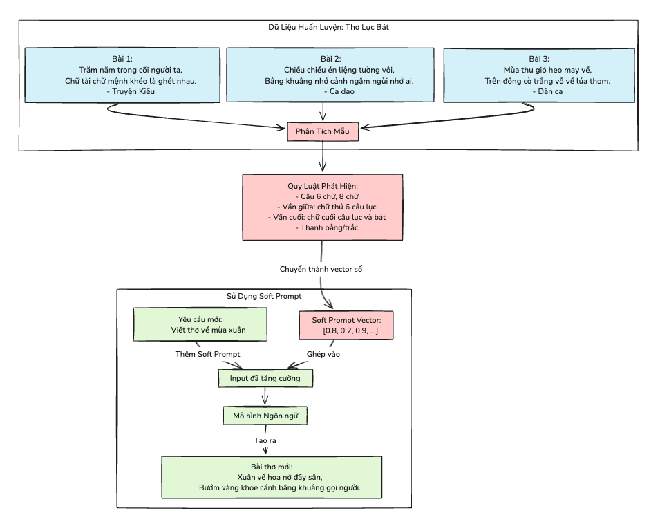

# Phương Pháp Điều Chỉnh Chỉ Thị (Prompt Tuning)

Prompt tuning là một phương pháp tiết kiệm tham số bằng cách điều chỉnh biểu diễn đầu vào thay vì trọng số mô hình. Không giống như tinh chỉnh truyền thống cập nhật tất cả các tham số mô hình, prompt tuning thêm và tối ưu hóa một tập nhỏ các token có thể huấn luyện trong khi giữ nguyên mô hình cơ sở.

## Tìm Hiểu Về Prompt Tuning

Prompt tuning là một phương pháp thay thế tiết kiệm tham số cho việc tinh chỉnh mô hình bằng cách thêm các vector liên tục có thể huấn luyện (soft prompts) vào trước văn bản đầu vào. Không giống như các chỉ thị rời rạc (discrete prompt), những soft prompt này được học thông qua truyền ngược (back-propagation) trong khi giữ nguyên mô hình ngôn ngữ. Phương pháp này được giới thiệu trong ["The Power of Scale for Parameter-Efficient Prompt Tuning"](https://arxiv.org/abs/2104.08691) (Lester et al., 2021), cho thấy prompt tuning trở nên cạnh tranh hơn với việc tinh chỉnh mô hình khi kích thước mô hình tăng lên. Trong bài báo, với khoảng 10 tỷ tham số, prompt tuning đạt hiệu suất tương đương với tinh chỉnh mô hình trong khi chỉ sửa đổi vài trăm tham số cho mỗi tác vụ.

Các soft prompt này là các vector liên tục trong không gian embedding của mô hình được tối ưu hóa trong quá trình huấn luyện. Không giống như các chỉ thị rời rạc truyền thống sử dụng các token ngôn ngữ tự nhiên, soft prompt là các chỉ thị không có ý nghĩa nhưng được học để tạo ra hành vi mong muốn từ mô hình đã đóng băng thông qua gradient descent. Kỹ thuật này đặc biệt hiệu quả cho các kịch bản đa tác vụ vì mỗi tác vụ chỉ cần lưu trữ một vector prompt nhỏ (thường là vài trăm tham số) thay vì một bản sao mô hình đầy đủ. Phương pháp này không chỉ duy trì bộ nhớ tối thiểu mà còn cho phép chuyển đổi tác vụ nhanh chóng bằng cách chỉ cần hoán đổi vector prompt mà không cần tải lại mô hình.

## Quá trình huấn luyện

Soft prompt thường có từ **8 đến 32 token** và có thể được **khởi tạo ngẫu nhiên hoặc từ văn bản hiện có**. Phương pháp khởi tạo đóng vai trò quan trọng trong quá trình huấn luyện, với việc khởi tạo dựa trên văn bản thường hoạt động tốt hơn so với khởi tạo ngẫu nhiên.

Trong quá trình huấn luyện, chỉ các tham số prompt được cập nhật trong khi mô hình cơ sở vẫn đóng băng. Cách tiếp cận tập trung này sử dụng các mục tiêu huấn luyện tiêu chuẩn nhưng đòi hỏi chú ý đến tốc độ học và hành vi gradient của các token prompt.



## Triển khai với PEFT

Thư viện PEFT giúp việc triển khai prompt tuning trở nên đơn giản. Đây là một ví dụ cơ bản:

```python
from peft import PromptTuningConfig, TaskType, get_peft_model
from transformers import AutoModelForCausalLM, AutoTokenizer

# Tải mô hình cơ sở
model = AutoModelForCausalLM.from_pretrained("your-base-model")
tokenizer = AutoTokenizer.from_pretrained("your-base-model")

# Điều chỉnh thông số prompt tuning
peft_config = PromptTuningConfig(
    task_type=TaskType.CAUSAL_LM,
    num_virtual_tokens=8,  # Số token có thể huấn luyện
    prompt_tuning_init="TEXT",  # Khởi tạo từ văn bản
    prompt_tuning_init_text="Phân loại xem văn bản này là tích cực hay tiêu cực:",
    tokenizer_name_or_path="your-base-model",
)

# Tạo mô hình có thể prompt-tune
model = get_peft_model(model, peft_config)
```

## So sánh với các phương pháp khác

Khi so sánh với các phương pháp PEFT khác, prompt tuning nổi bật về hiệu quả. Trong khi LoRA cung cấp số lượng tham số và bộ nhớ thấp nhưng yêu cầu tải adapter khi chuyển đổi tác vụ, prompt tuning đạt được mức sử dụng tài nguyên thậm chí thấp hơn và cho phép chuyển đổi tác vụ ngay lập tức. Ngược lại, tinh chỉnh đầy đủ đòi hỏi tài nguyên đáng kể và yêu cầu các bản sao mô hình riêng biệt cho các tác vụ khác nhau.

| Phương pháp | Tham số | Bộ nhớ | Chuyển đổi tác vụ |
|--------|------------|---------|----------------|
| Prompt Tuning | Rất thấp | Tối thiểu | Dễ dàng |
| LoRA | Thấp | Thấp | Yêu cầu tải |
| Tinh chỉnh đầy đủ | Cao | Cao | Cần bản sao mô hình mới |

Khi triển khai prompt tuning, hãy bắt đầu với một số lượng nhỏ token ảo (8-16) và chỉ tăng lên nếu độ phức tạp của tác vụ yêu cầu. Khởi tạo từ văn bản thường cho kết quả tốt hơn so với khởi tạo ngẫu nhiên, đặc biệt khi sử dụng văn bản liên quan đến tác vụ. Chiến lược khởi tạo nên phản ánh độ phức tạp của tác vụ mục tiêu của bạn.

Huấn luyện đòi hỏi những cân nhắc hơi khác so với tinh chỉnh đầy đủ. Tốc độ học (learning rates) cao hơn thường sẽ cho kết quả tốt hơn, nhưng cũng cần theo dõi cẩn thận *gradient* của token prompt. Kiểm tra thường xuyên trên các ví dụ đa dạng giúp đảm bảo hiệu suất mạnh mẽ trong các tình huống khác nhau.

## Ứng dụng

Prompt tuning xuất sắc trong một số kịch bản:

1. Triển khai đa tác vụ
2. Môi trường hạn chế tài nguyên
3. Thích ứng tác vụ nhanh chóng
4. Ứng dụng nhạy cảm về quyền riêng tư

Khi mô hình nhỏ hơn, prompt tuning trở nên kém cạnh tranh hơn so với tinh chỉnh đầy đủ. Ví dụ, trên các mô hình như SmolLM2, prompt tuning ít liên quan hơn so với tinh chỉnh đầy đủ.

## Các bước tiếp theo

⏭️ Chuyển sang [Hướng dẫn LoRA Adapters](./notebooks/finetune_sft_peft.ipynb) để tìm hiểu cách tinh chỉnh một mô hình với LoRA adapters.

## Tài liệu tham khảo
- [Tài liệu về thư viện PEFT](https://huggingface.co/docs/peft)
- [Bài báo nghiên cứu về Prompt Tuning](https://arxiv.org/abs/2104.08691) 
- [Hướng dẫn thực hành của Hugging Face](https://huggingface.co/learn/cookbook/prompt_tuning_peft)