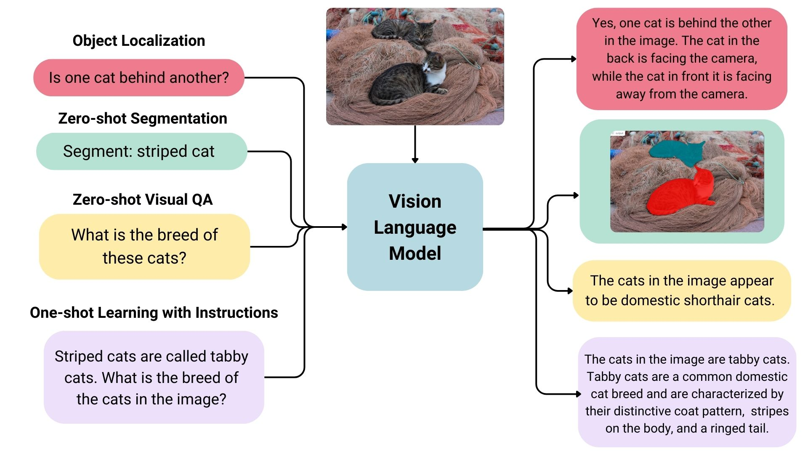

# Mô hình Ngôn ngữ Thị giác (Visual Language Models)

Mô hình Ngôn ngữ Thị giác (VLMs) thu hẹp khoảng cách giữa hình ảnh và văn bản, cho phép thực hiện các tác vụ nâng cao như tạo chú thích cho ảnh, trả lời câu hỏi dựa trên hình ảnh hoặc hiểu mối quan hệ giữa dữ liệu văn bản và hình ảnh. Kiến trúc của chúng được thiết kế để xử lý liền mạch cả hai phương thức.

### Kiến trúc

VLMs kết hợp các thành phần xử lý hình ảnh với các mô hình sinh văn bản để đạt được sự hiểu biết thống nhất. Các yếu tố chính trong kiến trúc của chúng là:


- **Bộ mã hóa hình ảnh (Image Encoder)**: Biến đổi hình ảnh thô thành các biểu diễn số học nhỏ gọn. Các bộ mã hóa được huấn luyện trước như CLIP hoặc vision transformers (ViT) thường được sử dụng.
- **Bộ chiếu nhúng (Embedding Projector)**: Ánh xạ các đặc trưng của hình ảnh vào không gian tương thích với các phép nhúng văn bản, thường sử dụng các lớp dày đặc (dense layers) hoặc các phép biến đổi tuyến tính.
- **Bộ giải mã văn bản (Text Decoder)**: Hoạt động như thành phần sinh ngôn ngữ, chuyển thông tin đa phương thức đã hợp nhất thành văn bản mạch lạc. Ví dụ bao gồm các mô hình sinh (generative models) như Llama hoặc Vicuna.
- **Bộ chiếu đa phương thức (Multimodal Projector)**: Cung cấp một lớp bổ sung để trộn lẫn các biểu diễn hình ảnh và văn bản. Nó rất quan trọng đối với các mô hình như LLaVA để thiết lập các kết nối mạnh mẽ hơn giữa hai phương thức.

Hầu hết các VLMs tận dụng các bộ mã hóa hình ảnh và bộ giải mã văn bản đã được huấn luyện trước và căn chỉnh chúng thông qua việc tinh chỉnh bổ sung trên các tập dữ liệu hình ảnh-văn bản được ghép nối. Cách tiếp cận này giúp việc huấn luyện hiệu quả đồng thời cho phép các mô hình khái quát hóa một cách hiệu quả.

### Cách sử dụng


VLMs được áp dụng cho một loạt các tác vụ đa phương thức. Khả năng thích ứng của chúng cho phép chúng hoạt động trong các lĩnh vực đa dạng với các mức độ tinh chỉnh khác nhau:

- **Chú thích hình ảnh (Image Captioning)**: Tạo mô tả cho hình ảnh.
- **Trả lời câu hỏi bằng hình ảnh (Visual Question Answering - VQA)**: Trả lời câu hỏi về nội dung của hình ảnh.
- **Truy xuất đa phương thức (Cross-Modal Retrieval)**: Tìm văn bản tương ứng cho một hình ảnh nhất định hoặc ngược lại.
- **Ứng dụng sáng tạo (Creative Applications)**: Hỗ trợ thiết kế, tạo tác phẩm nghệ thuật hoặc tạo nội dung đa phương tiện hấp dẫn.



Việc huấn luyện và tinh chỉnh VLMs phụ thuộc vào các tập dữ liệu chất lượng cao ghép nối hình ảnh với chú thích văn bản. Các công cụ như thư viện `transformers` của Hugging Face cung cấp quyền truy cập thuận tiện vào các VLMs đã được huấn luyện trước và quy trình làm việc được sắp xếp hợp lý để tinh chỉnh tùy chỉnh.

### Định dạng trò chuyện (Chat Format)

Nhiều VLMs được cấu trúc để tương tác theo kiểu chatbot, nâng cao khả năng sử dụng. Định dạng này bao gồm:

- Một **câu lệnh hệ thống (system message)** đặt vai trò hoặc ngữ cảnh cho mô hình, chẳng hạn như "Bạn là trợ lý phân tích dữ liệu hình ảnh."
- **Truy vấn của người dùng (user queries)** kết hợp đầu vào văn bản và hình ảnh liên quan.
- **Phản hồi của trợ lý (assistant responses)** cung cấp đầu ra văn bản bắt nguồn từ phân tích đa phương thức.

Cấu trúc hội thoại này trực quan và phù hợp với mong đợi của người dùng, đặc biệt là đối với các ứng dụng tương tác như dịch vụ khách hàng hoặc các công cụ giáo dục.

Dưới đây là ví dụ về cách hiển thị đầu vào được định dạng:

```json
[
    {
        "role": "system",
        "content": [{"type": "text", "text": "Bạn là một Mô hình Ngôn ngữ Thị giác chuyên giải thích dữ liệu hình ảnh từ hình ảnh biểu đồ..."}]
    },
    {
        "role": "user",
        "content": [
            {"type": "image", "image": "<image_data>"},
            {"type": "text", "text": "Giá trị cao nhất trong biểu đồ cột là bao nhiêu?"}
        ]
    },
    {
        "role": "assistant",
        "content": [{"type": "text", "text": "42"}]
    }
]
```

**Làm việc với nhiều hình ảnh và video**

VLMs cũng có thể xử lý nhiều hình ảnh hoặc thậm chí video bằng cách điều chỉnh cấu trúc đầu vào để chứa các đầu vào hình ảnh tuần tự hoặc song song. Đối với video, các khung hình có thể được trích xuất và xử lý như các hình ảnh riêng lẻ, trong khi vẫn duy trì thứ tự thời gian.

## Tài liệu tham khảo

- [Hugging Face Blog: Mô hình Ngôn ngữ Thị giác](https://huggingface.co/blog/vlms)
- [Hugging Face Blog: SmolVLM](https://huggingface.co/blog/smolvlm)

## Các bước tiếp theo

⏩ Thử [vlm_usage_sample.ipynb](./notebooks/vlm_usage_sample.ipynb) để thử các cách sử dụng khác nhau của SMOLVLM.
